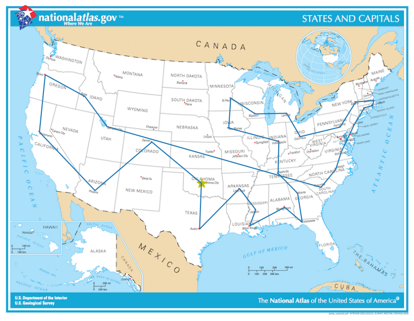
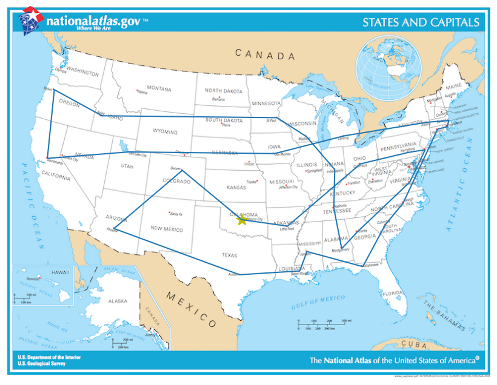

# Experiment: Simulated Annealing for Traveling Salesman Problem

In this experiment, I implemented several local search algorithms to solve the Traveling Salesman Problem between a few dozen US state capitals - based on starting codes and instructions from an assignment in Udacity's Artificial Intelligence course.

+ **Hill climbing**: find the best successor state; if no more, then break
+ **Local beam search**: similar to hill climbing, but begin with k randomly generated states. At each step, select k best successors from all the neighbors of all k states, then repeats.
+ **Simulated annealing**: generate a random successor in the neighborhood of current state; if it's better, then move there; otherwise, still consider moving there with a probability determined by the current "temperature."

I find that simulated annealing tends to perform quite well, compared to the other two algorithms. With different number of nodes, simulated annealing tends to generate a path that can potentially be quite close to optimal - at least according to my visual inspection.

It is interesting how randomness and the simulation of a physical process (temperature and annealing) can give good solutions to an NP-complete problem like TSP!

[This notebook](T-Local_Search.ipynb) can be run sequentially cell by cell in order to illustrate the performance of each algorithm.

## Example results
### Hill climbing

### Local beam search

### Simulated annealing
